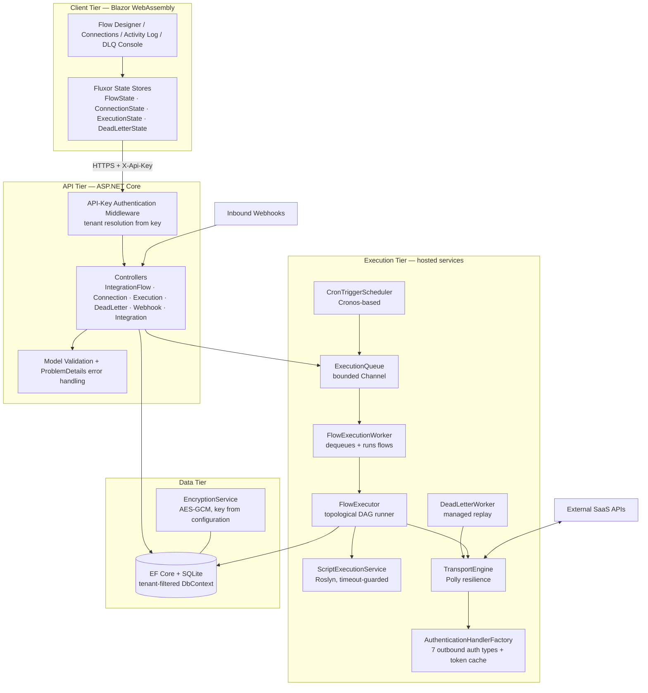
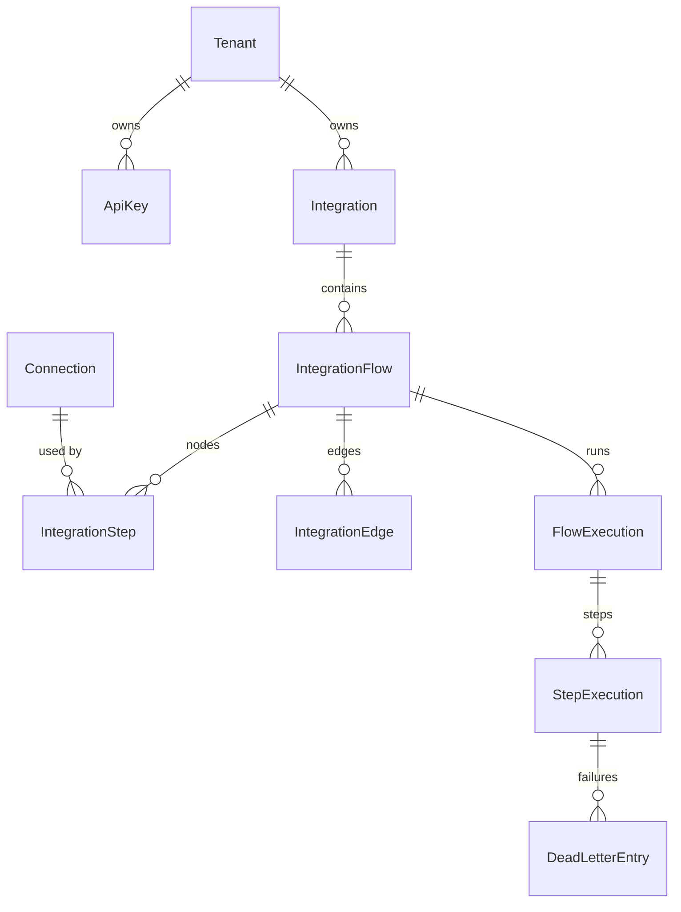

# SimpleIPaaS — Solution Architecture

**Document type:** Solution Architecture & Technical Implementation Specification
**Product:** SimpleIPaaS — Enterprise Integration Platform as a Service
**Audience:** Engineering, architecture review board, client technical stakeholders

---

## 1. Executive Overview

SimpleIPaaS is an enterprise integration platform that lets teams design, execute, and monitor API-to-API integration flows without writing deployable code. Users compose flows visually as a directed acyclic graph (DAG) of nodes (HTTP actions, mappers, branches, persisted state, debug probes), connect them to reusable authenticated Connections, and run them on demand, on a schedule, or in response to inbound webhooks. Every execution is recorded step-by-step with full request/response capture, failures are captured in a dead-letter queue with managed replay, and all data is isolated per tenant.

The platform is delivered as two deployable units:

| Unit | Technology | Responsibility |
|---|---|---|
| **SimpleIPaaS.Api** | ASP.NET Core (.NET 10) | REST API, execution engine, trigger scheduler, background workers, persistence |
| **SimpleIPaaS.Client** | Blazor WebAssembly | Flow designer, connection management, monitoring UI |

---

## 2. Architecture Diagram



---

## 3. Technology Stack

| Concern | Technology | Notes |
|---|---|---|
| Runtime | .NET 10 | LTS-track |
| API | ASP.NET Core Web API | Controllers + middleware pipeline |
| Frontend | Blazor WebAssembly | SPA, no server rendering dependency |
| State management | Fluxor | Redux-style stores/effects |
| Flow canvas | Z.Blazor.Diagrams | Node/port/link model |
| ORM | Entity Framework Core (SQLite provider) | Global tenant query filters |
| Resilience | Polly v8 `ResiliencePipeline` | Retry + timeout on outbound HTTP |
| Scheduling | Cronos | Cron expression evaluation |
| Scripting | Microsoft.CodeAnalysis.CSharp.Scripting (Roslyn) | Timeout-guarded, curated references |
| Secrets at rest | AES-GCM (`EncryptionService`) | Key injected via configuration/environment |
| Logging | `ILogger` structured logging throughout engine + workers | Correlation by ExecutionId |
| Health | ASP.NET Core Health Checks | `/health` endpoint incl. DB probe |

**Database note:** SQLite is the packaged default for single-node deployments. The data layer is confined behind repository interfaces (`IIntegrationRepository`, `IConnectionRepository`, `IExecutionRepository`), so promoting to PostgreSQL/SQL Server is a provider swap plus migration generation, with no engine changes.

---

## 4. Layered Solution Structure

```
src/
  SimpleIPaaS.Domain          → Entities, enums, no dependencies
  SimpleIPaaS.Application     → FlowExecutor, DeadLetterService, script services, repository interfaces
  SimpleIPaaS.Infrastructure  → EF Core context, repositories, TransportEngine, auth handlers, encryption
  SimpleIPaaS.Api             → Controllers, middleware, hosted services, composition root
  SimpleIPaaS.Client          → Blazor WASM UI, Fluxor stores
  SimpleIPaaS.Shared          → DTOs shared between Api and Client
```

Dependency rule: `Api → Application → Domain`; `Infrastructure` implements `Application` interfaces; `Client` references only `Shared`.

---

## 5. Database Design

All tables carry `TenantId (GUID)` and are covered by an EF Core global query filter bound to the per-request `ITenantContext`.



### 5.1 Core tables

| Table | Key columns | Purpose |
|---|---|---|
| `Integrations` | Id, TenantId, Name, Description | Logical grouping of flows |
| `IntegrationFlows` | Id, TenantId, IntegrationId, Name, Status, **TriggerType**, **CronExpression**, **WebhookSecret**, PersistedStateJson | Flow definition + trigger configuration |
| `IntegrationSteps` | Id, FlowId, NodeType, NodeName, EndpointUrl, HttpMethod, AuthType, AuthConfigJson, MappingCode, UrlCode, PreFlightCode, PostFlightCode, ConnectionId, PositionX/Y | DAG nodes |
| `IntegrationEdges` | Id, FlowId, SourceNodeId, TargetNodeId, SourcePortId, TargetPortId | DAG edges (Branch uses `true`/`false` source ports) |
| `Connections` | Id, TenantId, Name, BaseUrl, AuthType, AuthConfigJson *(AES-GCM encrypted)*, Status | Reusable authenticated endpoints |
| `FlowExecutions` | Id, TenantId, FlowId, Status, StartedAt, CompletedAt, TotalRecords, SuccessCount, FailedCount, TriggerSource | Run header; `TotalRecords` maintained by the executor |
| `StepExecutions` | Id, ExecutionId, StepId, NodeName, Status, HttpStatusCode, RequestPayload, ResponsePayload, ErrorMessage, StartedAt, CompletedAt | Per-node audit trail |
| `DeadLetterEntries` | Id, TenantId, StepExecutionId, FlowId, Payload, ErrorMessage, Status (Pending/Retrying/Resolved/Discarded), RetryCount, LastAttemptAt | Failure capture + managed replay |
| `ApiKeys` | Id, TenantId, Name, KeyHash (SHA-256), CreatedAt, RevokedAt | Platform authentication; plaintext key shown once at creation |

### 5.2 Schema management

Schema is created/upgraded at startup through `DatabaseSchemaInitializer`, which is idempotent and additive (creates missing tables, adds missing columns). All schema changes must go through this initializer so single-file deployments upgrade in place.

---

## 6. API Design

Base path `/api`. All endpoints except `POST /api/webhooks/{flowId}/{secret}` and `/health` require a valid `X-Api-Key` header. JSON errors follow RFC 7807 `ProblemDetails`. Invalid input returns `400`, unknown ids `404`, missing/invalid key `401`.

### 6.1 Endpoint catalogue

| Method + Route | Purpose |
|---|---|
| `GET /api/integrations` / `POST` / `PUT /{id}` / `DELETE /{id}` | Integration CRUD |
| `GET /api/integrationflow` | List flows (summary DTO) |
| `GET /api/integrationflow/{id}` | Flow detail incl. nodes/edges/trigger config |
| `POST /api/integrationflow` | Create flow (validated: node names unique, edges reference nodes, no cycles) |
| `PUT /api/integrationflow/{id}` | Update flow (tenant-checked) |
| `DELETE /api/integrationflow/{id}` | Delete flow + dependent steps/edges |
| `POST /api/integrationflow/{id}/run` | Enqueue execution; returns `202 Accepted` + `executionId` immediately |
| `GET /api/executions?flowId=&status=&page=&pageSize=` | Execution history, paged |
| `GET /api/executions/{id}` | Execution header |
| `GET /api/executions/{id}/steps` | Step timeline |
| `POST /api/executions/{id}/cancel` | Cooperative cancellation of a queued/running execution |
| `GET /api/deadletters?status=` | DLQ listing |
| `POST /api/deadletters/{id}/retry` | Managed replay of a dead letter |
| `POST /api/deadletters/{id}/discard` | Mark discarded |
| `POST /api/webhooks/{flowId}/{secret}` | Inbound webhook trigger; secret must match flow's `WebhookSecret` (constant-time compare); body becomes trigger payload; returns `202` + executionId |
| `GET /api/connections` (secrets always redacted) / `GET /{id}` (secrets redacted) / `POST` / `PUT /{id}` / `DELETE /{id}` / `POST /{id}/test` | Connection CRUD + connectivity test |
| `GET /health` | Liveness + DB readiness |

**Removed by design:** the former `GET /api/executions/dev/seed` endpoint does not exist in the production build.

### 6.2 Authentication & tenancy contract

- Client sends `X-Api-Key: <plaintext key>`.
- Middleware hashes it (SHA-256), looks up `ApiKeys`, rejects with `401` if absent/revoked, otherwise sets `ITenantContext.TenantId` from the key's row. **The client can never assert its own tenant.**
- A development bootstrap path (`Development` environment only) provisions a default tenant + key and logs it on first start so local setup is friction-free.

---

## 7. Execution Engine

### 7.1 Asynchronous, queued execution

`POST /run`, webhook hits, and cron firings all funnel into one path:

1. An `ExecutionRequest { FlowId, TenantId, TriggerSource, TriggerPayload }` is written to a bounded `System.Threading.Channels.Channel` (`IExecutionQueue`).
2. A `FlowExecution` row is created immediately in `Queued` status and its id is returned to the caller (`202 Accepted`).
3. `FlowExecutionWorker` (hosted service) dequeues with configurable parallelism (`Execution:MaxConcurrency`, default 4) and runs `FlowExecutor.ExecuteFlowAsync(request, cancellationToken)`.
4. **Per-flow serialization:** a keyed `SemaphoreSlim` ensures at most one concurrent execution per flow, protecting `PersistedStateJson` from lost updates.
5. **Cancellation:** each running execution registers a `CancellationTokenSource` in an in-memory registry; `POST /executions/{id}/cancel` signals it; the executor observes the token between nodes and inside transport calls, marking the run `Cancelled`.
6. **Flow-level timeout:** `Execution:MaxFlowDurationSeconds` (default 600) linked into the token.

### 7.2 DAG semantics (unchanged, proven)

- Topological sort with cycle detection; unreachable branch arms are pruned via active-node gating.
- Cumulative named-node state: each node's output is appended to the shared `FlowStateContext` JSON under its `NodeName`; downstream scripts address prior outputs by name.
- Node types: `HttpAction`, `Mapping`, `Branch` (boolean script → `true`/`false` port), `PersistedState`, `Debug`.
- Webhook trigger payloads are injected into `FlowStateContext` under the reserved key `trigger` before the first node runs.
- The executor sets `TotalRecords` (= executed step count) alongside `SuccessCount`/`FailedCount`.

### 7.3 Scripting (Roslyn) — guarded execution

User scripts (mapping, dynamic URL, pre/post-flight, branch predicates) run through `AdvancedCodeExecutionService` with these mandatory guards:

- **Wall-clock timeout** per script (`Scripting:TimeoutSeconds`, default 10) enforced via linked `CancellationToken`; timeout fails the step with an explicit message.
- **Curated reference set** — only the platform-supplied assemblies/imports are added (System core, LINQ, `System.Text.Json`, Newtonsoft.Json); scripts are compiled per-node and cached by content hash.
- Script exceptions are captured and JSON-escaped into structured step errors; raw exception text is never emitted as unescaped JSON.
- **Deployment boundary (documented constraint):** Roslyn scripting is in-process; the platform's trust model is *authenticated tenant users are trusted script authors*. Deployments serving untrusted authors must enable the roadmap out-of-process sandbox (§12).

### 7.4 Resilience & retry budget

- Transport-level: Polly pipeline — 3 retries, exponential backoff, 30s attempt timeout, retry on 5xx/408/429 only (**not** on other 4xx, which are non-retryable client errors).
- Flow-level: a step that exhausts transport retries fails the step, dead-letters it, and aborts downstream nodes.
- DLQ-level: `DeadLetterWorker` polls every 60s and replays only `HttpAction` steps flagged replay-safe (GET/PUT/DELETE, or POST where the flow opts in), max 5 attempts, then `Discarded`. Replays re-run the node through the full pipeline (UrlCode/PreFlight/auth), not a raw payload re-send.

---

## 8. Trigger Architecture

| Trigger | Mechanism |
|---|---|
| **Manual** | `POST /api/integrationflow/{id}/run` → queue |
| **Webhook** | `POST /api/webhooks/{flowId}/{secret}` — anonymous route, authenticated by per-flow secret (generated server-side, constant-time compared); payload passed to the flow |
| **Cron** | `CronTriggerScheduler` hosted service: every 30s scans Active flows with `TriggerType=Cron`, evaluates `CronExpression` via Cronos (UTC), enqueues when due; per-flow `NextRunAt` bookkeeping prevents double-fires |
| **Polling** | Modeled as Cron + an initial HttpAction node (documented pattern); no separate infrastructure |

Trigger configuration (type, cron expression, webhook URL display + secret regeneration) is edited in the Flow Designer's flow-settings panel.

---

## 9. Outbound Connection Authentication

`AuthenticationHandlerFactory` provides one handler per `AuthType`; every type is configurable from the Connection Wizard and usable by HTTP action cards, either via a referenced Connection or inline step auth:

| AuthType | Behaviour |
|---|---|
| `None` | No decoration |
| `Basic` | `Authorization: Basic base64(user:pass)` |
| `ApiKey` | Configurable header name + value (or query parameter) |
| `Bearer` | Static bearer token |
| `OAuth2ClientCredentials` | **Real client-credentials grant**: POST to token endpoint with client id/secret/scope, cache token per connection until expiry (with 60s skew), refresh on 401 once |
| `OAuth2RefreshToken` | Refresh-token grant against token endpoint; rotates stored refresh token when the server returns a new one |
| `OAuth2AuthCode` | Operator completes the code exchange out-of-band; the platform stores access + refresh tokens and thereafter behaves as `OAuth2RefreshToken` (auto-refresh on expiry/401) |
| `Custom` | Arbitrary static header set (name/value pairs) defined in config JSON |

Token cache: in-memory `ConcurrentDictionary` keyed by ConnectionId; invalidated on connection update.

---

## 10. Security Architecture

| Control | Implementation |
|---|---|
| Platform authn | Hashed API keys (SHA-256 at rest), `X-Api-Key` header, middleware short-circuits 401 |
| Tenant isolation | TenantId derived **only** from the authenticated key; EF global query filters on every tenant-scoped entity; no repository path uses `IgnoreQueryFilters` without re-asserting the tenant match |
| Secrets at rest | Connection `AuthConfigJson` AES-GCM encrypted; key supplied via `Encryption:Key` configuration/environment (32 bytes); startup fails fast if missing outside Development |
| Secrets in transit | API responses never include decrypted auth config — all reads redact; decryption happens only inside the transport layer |
| Webhooks | Per-flow high-entropy secret, constant-time comparison, no tenant header trust |
| Script safety | Timeout + curated references + structured error capture (§7.3); trust model documented |
| CORS | Configured allow-list (`Cors:AllowedOrigins`); wide-open CORS only in Development |
| Input validation | DTO validation + safe enum parsing (`TryParse`) → 400, never 500 |
| Error hygiene | ProblemDetails responses; internal exception details logged, not returned |
| Logging hygiene | Auth config, API keys, and tokens are never written to logs |

---

## 11. Data Flow (end-to-end)

1. **Design time** — user builds the DAG in the designer; client validates (unique node names, connected graph, no cycles) before `POST/PUT`; server re-validates.
2. **Trigger** — manual/webhook/cron produces an `ExecutionRequest` on the queue; caller immediately receives `executionId`.
3. **Execution** — worker acquires the per-flow lock, loads the flow, topologically orders nodes, and walks the DAG. Per node: UrlCode → PreFlight script → auth decoration → transport (Polly) → PostFlight script → state append → `StepExecution` persisted.
4. **Failure** — step failure writes a `DeadLetterEntry`, marks the execution `Failed`, halts downstream.
5. **Observation** — Activity Log lists executions (paged); Execution Detail shows the step timeline with payloads; DLQ Console lists failures with retry/discard actions.
6. **Replay** — DLQ worker or manual retry re-runs the node through the full pipeline; success resolves the entry.

---

## 12. Roadmap (post-delivery hardening)

- Out-of-process script sandbox (isolated worker process / WASM) for untrusted-author deployments.
- PostgreSQL provider + EF migrations for multi-node scale-out; distributed execution locks (e.g., Redis).
- OAuth2 interactive authorization-code UI flow with PKCE.
- Connector marketplace (queue, database, file/SFTP, SaaS-specific connectors) atop the existing `HttpAction` abstraction.
- OpenTelemetry traces/metrics export; per-tenant rate limiting; pagination-aware HttpAction (LinkHeader/Cursor/PageOffset are already modeled in the domain).
